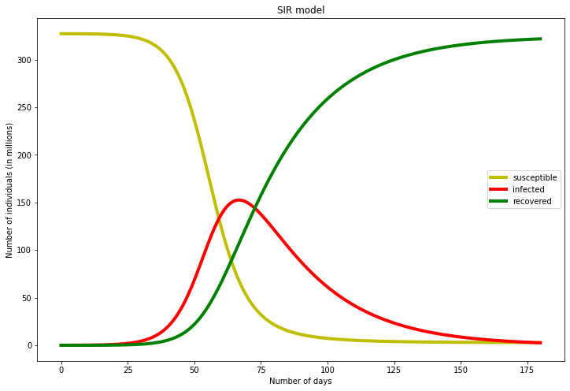
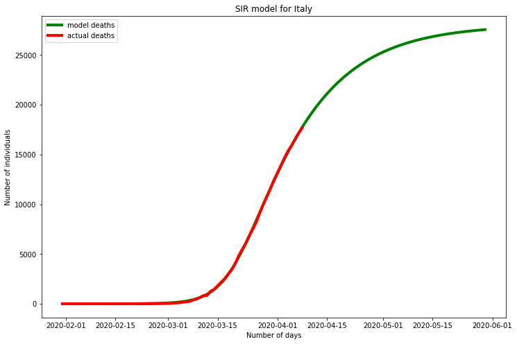
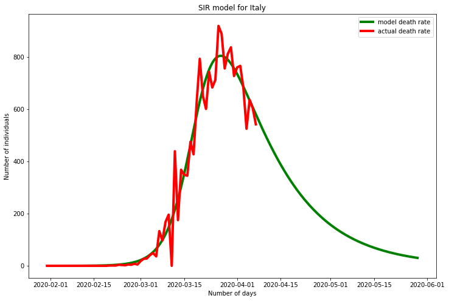

# Covid19 Models

## Getting started

This repository contains code to generate models and Python Notebooks to do
visualizations using publicly available data for the COVID-19 outbreak.

* [Installation Instructions](./INSTALL.md)
* [Fitting Models](./MODEL_FITTING.md)
* [Visualization Notebook](./)

## SIR Model

An [SIR model](https://mathworld.wolfram.com/Kermack-McKendrickModel.html) is a commonly used model for the spread of infections across a population. The SIR model maintains 3 different population subgroups:

* **(S)usceptible**: Number of individuals who are susceptible to getting the infection.
* **(I)nfected**: Number of individuals currently infected and contagious. (This should look familiar to those who stare at images of "flattening the curve".)
* **(R)ecovered**: Number of individuals who have recovered from the disease and are immune and no longer contagious.+

The differential equations guiding the SIR process over time (t) is:

One way to understand the SIR model is a set of 3 buckets representing the populations. dS/dt is the rate of growth
of the susceptible population, which should be negative since the population will continue to get infected
over time. 

Beta represents the rate at which a single infected person transmits the disease to another individual assuming all individuals
are susceptible. Note that the actual transmission rate will slow down over time as the susceptible population decreases.

Gamma is the recovery rate, i.e. inverse of the number of days it takes for an infected individual to no longer be contagious.

## Model Simulation Details

To simulate the SIR model with discrete steps, we can use the [Taylor series](https://en.wikipedia.org/wiki/Taylor_series)
expansion. A first order approximator of a function  is sufficient for
an accurate simulation as long as the step size $\delta t$ is sufficiently small. Substituting in the differential
equations above, we get first-order approximators:

## Fitting models to data

An SIR model can be built from 4 parameters. 

1. **Initial susceptible population:** When modeling deaths for example, this is the population of individuals who will eventually die from COVID-19. Dividing this value by the total population of the region can give us the *population fatality rate*. If the same fatality rate per infected individual is assumed across all regions, then this can tell us how good this region is at *suppressing* the disease, i.e. preventing parts of their population from ever getting the disease before the virus starves to death.
2. **Average time of contagion:** This parameter determines how long an average infected person remains contagious. This metric involves the sum of the incubation period, symptomatic period, and contagious period after symptoms disappear.
3. **Average rate of spread:** This parameter can be thought of as the average number of people a person infects over a time period (e.g. 1 day). It can be influenced by population density, cultural aspects around distance and comfort zone, social distancing measures, wearing of masks, and other types of human social and physical behavior.
4. **Initial infected population:** The datasets include reported cases and deaths, but these are probably not reflective of reality due to delays in testing, etc. To fit an SIR model, one needs to also estimate at the start of simulation, how many people are actually infected/dead.

## Acknowledgements

* [COVID-19 Data Github](https://github.com/CSSEGISandData/COVID-19): This is the project's data source for COVID-19 cases and deaths, and is conscientiously updated daily.
* [IHME COVID-19 Modeling](http://www.healthdata.org/covid/updates): Another great site with mathematical modeling of COVID-19 spread. I took an independent approach with SIR modeling, and drew some inspiration from this site to do data smoothing to better fit models.